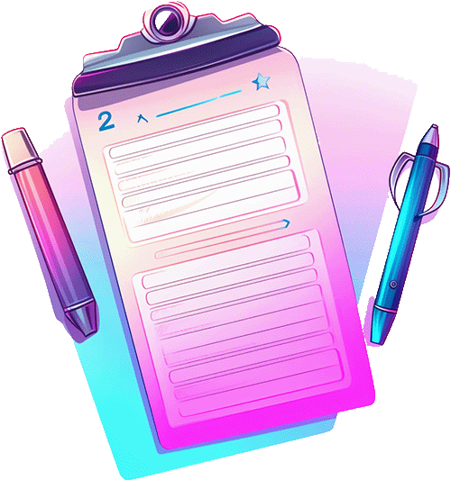

# React Quiz Application

An interactive quiz application built with React that tests users' knowledge through multiple-choice questions with timed responses and detailed feedback.

## Features
- Multiple-choice questions with randomized answer options
- Timed questions with countdown timer
- Answer validation with visual feedback
- Skip question functionality
- Detailed quiz summary with statistics
- Progress tracking
- Visual feedback for correct/incorrect answers
- Question-by-question review in summary

## Technologies Used
- React 19
- JavaScript (ES6+)
- Vite 6
- CSS for styling
- ESLint for code quality

## Advanced Features
- Dynamic timer management with different durations based on answer state
- Randomized answer options using useRef for persistence
- Answer state management (selected, correct, wrong)
- Detailed statistics calculation (skipped, correct, wrong percentages)
- Question-by-question review with answer status
- Visual progress tracking
- Answer validation with delayed feedback

## React Hooks Used
- useState: For managing answer states and user responses
- useEffect: For timer management and cleanup
- useCallback: For memoizing event handlers
- useRef: For persisting shuffled answers

## Project Structure
- Components:
  - MainHeader: Application header with logo
  - Quiz: Main quiz container and state management
  - Question: Individual question display and logic
  - Answers: Answer options with randomization
  - QuestionTimer: Countdown timer with visual feedback
  - Summary: Final results and statistics
- Data:
  - questions.js: Quiz questions and answers

## Component Details
- MainHeader: Displays quiz logo and title
- Quiz: Manages quiz state and user answers
- Question: Handles question display, timer, and answer selection
- Answers: Displays randomized answer options with state-based styling
- QuestionTimer: Implements countdown with visual progress bar
- Summary: Shows final results with detailed statistics and question review

## Getting Started
1. Clone the repository
2. Install dependencies: `npm install`
3. Run development server: `npm run dev`
4. Build for production: `npm run build`

## Quiz Flow
1. Questions are presented one at a time
2. Each question has a 10-second timer
3. Answer selection triggers validation
4. Correct/incorrect feedback is shown
5. Progress to next question
6. Final summary shows complete results
